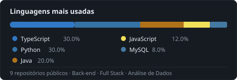

# Olá, eu sou o Lucas Rocha 👋

**Desenvolvedor Back-end em formação** · Análise e Desenvolvimento de Sistemas  
📍 Campina Grande, PB — Brasil

---

## Sobre mim

Graduando em ADS pela **Uninassau-Campina Grande**. Tenho forte interesse em back-end, banco de dados e automação de dados com Python e Java. Busco minha primeira oportunidade como desenvolvedor para aplicar meus conhecimentos em projetos reais e crescer junto com a equipe.

---

## 🛠️ Stack Técnica

**Back-end & Banco de Dados**

**Front-end**

---

## 📂 Projetos

| Projeto | Descrição | Linguagem |
|---|---|---|
| [Sistema-Full-Stack](https://github.com/lucaspy2215/Sistema-Full-Stack) | Primeiro sistema Full Stack — Back-End com Java, Front com Next.js e React | Java · TypeScript |
| [Agendamento Médico Mobile](https://github.com/lucaspy2215/Sistema_Projeto_Portifolio_Faculdade_parte_Final) | Sistema de agendamentos de consultas médicas para dispositivo Mobile | TypeScript |
| [SistemaCRUD](https://github.com/lucaspy2215/SistemaCRUD) | CRUD com Back-end, Banco de Dados e POO | Java |
| [SistemaCRUDPython](https://github.com/lucaspy2215/SistemaCRUDPython) | Adicionar, remover e atualizar registros com Python + MySQL | Python |
| [ApiChuva São João](https://github.com/lucaspy2215/ApiChuvaS-oJo-o) | API com dados de chuvas dos últimos 10 anos em Campina Grande | Python |
| [Análise IPCA](https://github.com/lucaspy2215/analise-ipca-python) | Análise de dados econômicos do IPCA | Python |
| [Portfólio Faculdade](https://github.com/lucaspy2215/Sistema_Projeto_Portifolio_Faculdade_parte_I) | Projeto integrador da faculdade — Parte I | TypeScript |

---

## 📊 Linguagens

---

## 🎓 Formação

**Análise e Desenvolvimento de Sistemas**  
Uninassau — Campina Grande, PB · Previsão: 12/2027

**Idiomas:** Inglês *(Intermediário)*

---

## 📬 Contato

